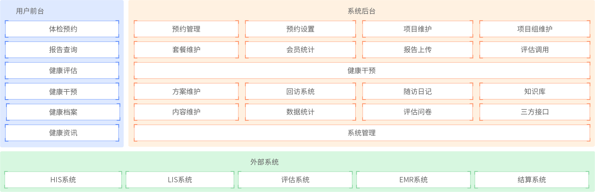
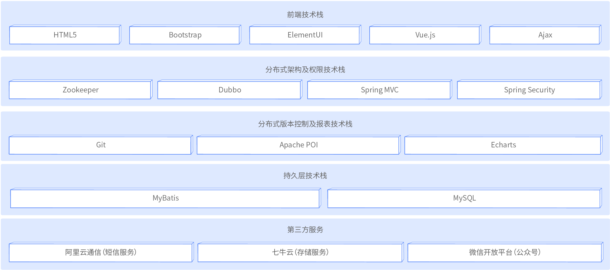

# 健康医疗(health-care)

## 前言

这是我的一个`SSM`个人学习项目 :)

所需技术:

1)Spring

2)SpringMVC

3)Redis

4)POI

5)MySQL

6)Mybatis

## 项目简介

### 项目介绍

健康管理系统是一款应用于健康管理机构的业务系统, 实现健康管理机构工作内容可视化, 患者管理专业化, 健康评估数字化, 健康干预流程化, 知识库集成化, 从而提高健康管理师的工作效率, 加强与患者间的互动, 增强管理者对健康管理机构运营情况的了解.

### 项目优势

- 分布式多级缓存实现冷热数据分离
- 异步RPC协议实现微服务的高负载方案
- 分布式高可靠性集群的服务注册中心方案
- 数据可视化展示方案
- 基于Apache POI框架实现Excel报表
- 基于Spring Security实现的权限控制

## 架构图

### 功能架构图

### 技术架构图

> 此处使用minio作为图片存储 -> https://github.com/mikuhuyo/minio

## 启动方式

这种ssm项目就不需要太多的说明了, 我相信你们的技术(不是我懒).

## 特别鸣谢

### 关注者

### 收藏者

## 整理不易-请这个b喝杯水?

---

